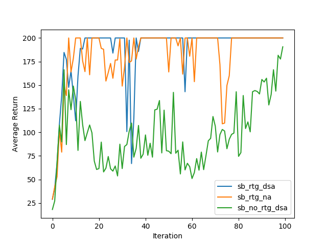
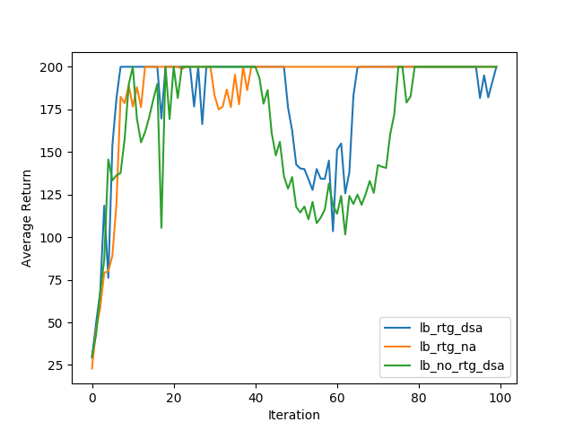

Homework 2: Policy Gradients

Problem 3

Small Batch Learning Curve

  

Large Batch Learning Curve

  

Using reward to go increases average return across iterations in both small and large batch experiments. 
Adding advantage standardization does not seem improve average returns, but does seem to lead to drops in returns
during intermediate iterations. Using large batch sizes seems to smooth out the curve, reducing noise in the average
return across iterations and leading to higher returns when using the trajectory-centric rewards.